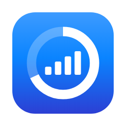

# ck-connect-check

A macOS menu bar app that shows how much of your mobile data plan is left, read
straight from a Huawei HiLink router and the carrier's own USSD menu.

## What it does

It sits in the menu bar as a signal glyph and a number — how much of the plan is
gone, and what share of it that is. Clicking opens a panel with a dial for the
month, live download and upload sparklines, the signal strength, the network the
router is attached to, and the carrier name.

The figure it shows is the real one. A router of this kind counts bytes
faithfully but has no idea what your plan is — it reports its data limit as
`0MB` — so the app asks the carrier directly over USSD, gets back an exact
remaining volume and an expiry date, and then carries that figure forward using
the router's own counter as the thing that moves. Press **Sync** in the panel to
re-ask the carrier; between syncs, nothing needs dialling.

Everything is local. There is no account, no server, no telemetry and no
database — one JSON settings file and the macOS Keychain.

## What it was tested against

Honestly: one device, one carrier, one Mac.

- **Router:** Huawei **B310s-22**, software version **21.333.01.00.00**, at the
  stock address `192.168.8.1`
- **Carrier menu:** the `#359#` USSD path is **one carrier's own menu**
  (Yas, Madagascar) — its wording and its `1 / 1 / 1` navigation are not a
  standard, and another carrier will answer something else entirely
- **macOS:** built and run on Apple silicon, macOS 15

Other HiLink routers speak the same `/api/` endpoints and will very likely show
usage, signal and throughput. The carrier sync is the part most likely to need
changing for you — see [`docs/ARCHITECTURE.md`](docs/ARCHITECTURE.md) for the
captured dialogue it is built on.

## Install and build

Node 22 or newer, on macOS.

```sh
git clone https://github.com/ckandrinirina/ck-connect-check.git
cd ck-connect-check
npm install
npm start
```

`npm start` builds and launches the app. It has no Dock icon and no window — it
lives entirely in the menu bar, so look up there rather than in the app switcher.

To build a real `.app` bundle:

```sh
npm run package
```

The result lands under `out/`. Drag it to Applications and it behaves like any
other menu bar utility.

The other scripts, for working on it:

| Command         | What it does                                               |
| --------------- | ---------------------------------------------------------- |
| `npm test`      | The whole suite                                            |
| `npm run build` | Type-checks and compiles into `dist/`                      |
| `npm run lint`  | ESLint over everything                                     |
| `npm run icon`  | Redraws the app icon and the menu bar glyphs from the SVGs |

`npm run icon` opens an offscreen Electron window to rasterise, so it needs a
real graphical session — it will hang in a sandboxed or headless shell, and so
will `npm test`, which runs it.

## The plan cap and the carrier sync

Two numbers make the dial work, and they come from different places.

**Your plan size** is typed into the panel — the field under the dial. Enter it
in Go (`150` means 150 Go) and it is remembered. The router cannot tell the app
this, so until it is set there is a usage figure but no percentage.

**What is actually left** comes from the carrier. Pressing **Sync** signs in to
the router, dials `#359#`, walks the menu, and reads a line like
`il vous reste 145835.9 Mo`. That reading is pinned to the router's byte counter
at the moment it arrives — an _anchor_ — and from then on the app subtracts the
counter's movement from it. So the panel stays accurate for days without dialling
again, including across quits, because the router keeps counting while the app is
closed.

A sync happens automatically only when there is nothing trustworthy to show: no
anchor yet, one that has expired, or one invalidated because the router's month
counter reset. A healthy anchor is simply carried forward. A **failed** sync is
never retried on a timer — the router locks the admin account after five refused
sign-ins, and a retry loop would walk you straight into that.

The first run therefore asks for the router's admin password, the one for the
router's own web interface.

## The config file

Settings live in a single JSON file:

```
~/Library/Application Support/ck-connect-check/config.json
```

It is written by the app; you can edit it by hand while the app is not running.

| Key                         | Meaning                                                                    |
| --------------------------- | -------------------------------------------------------------------------- |
| `host`                      | Router address, no scheme. Defaults to `192.168.8.1`                       |
| `pollIntervalSeconds`       | Seconds between polls while the panel is closed. Default `30`, minimum `5` |
| `activePollIntervalSeconds` | Seconds between polls while the panel is open. Default `2`, minimum `1`    |
| `warnThresholdPercent`      | Share of the plan at which the menu bar starts warning. Default `90`       |
| `planLimitBytes`            | Your plan size in bytes, or `null` when unset. Set it from the panel       |
| `syncStaleAfterMinutes`     | Minutes before the carrier figure counts as old. Default `30`              |
| `routerUsername`            | Router admin username. Absent until a credential has been saved            |
| `routerPasswordBlob`        | The password **as encrypted by the Keychain**, base64-encoded — see below  |
| `allowanceAnchor`           | The last carrier reading and the router counter it was pinned to           |

**Your router password is never in `config.json`.** It is encrypted by the macOS
Keychain through Electron's `safeStorage`, and only the ciphertext is stored in
`routerPasswordBlob` — unreadable by anything but this app, on this machine, as
this user. A bad or missing config file is never fatal: the app logs why and
runs on the defaults.

## Troubleshooting

**The menu bar says `offline`.** The router is not answering at `host`. Check you
are on its Wi-Fi, and open `http://192.168.8.1` in a browser — if that fails too,
it is the router, not the app. An unreachable router is a normal state here, not
an error: the app keeps polling and recovers on its own.

**The panel says the sign-in was refused.** The password is the router's admin
password, not your Wi-Fi password. Get it right on the second attempt rather than
the fifth: **the router locks the account after five consecutive refusals**, and
the app deliberately will not retry for you. If it does lock, sign in to the
router's web interface — or power-cycle it — to clear the lockout.

**Sync fails naming a number and an endpoint,** such as `125003 at
/api/ussd/send`. That is the router's own refusal code, carried up rather than
hidden. `125002` is an expired session and `125003` a spent token — both usually
clear on a second press. `100003` means the sign-in did not take. Anything else
is worth reporting, with the code and endpoint exactly as shown.

**The dial is missing.** Either no successful sync has happened yet, or no plan
size has been set. The panel says which, and neither is an error — a percentage
of a number the carrier never confirmed would be worse than nothing.

**The carrier dialogue times out or reads oddly.** The `#359#` menu is one
carrier's. If yours answers differently, the navigation in `src/hilink/ussd.ts`
is where it is encoded, and the captured dialogue in
[`docs/ARCHITECTURE.md`](docs/ARCHITECTURE.md) shows the shape it expects.

## How it is built

TypeScript and Electron, tested with Vitest. The router client, the quota
arithmetic, the Electron main process and the panel are separate layers, and the
arithmetic layer touches neither Electron nor the network — which is why almost
all of it is testable without a router present.
[`docs/ARCHITECTURE.md`](docs/ARCHITECTURE.md) documents the endpoints, the
sync design, and every decision behind them with its reason.
